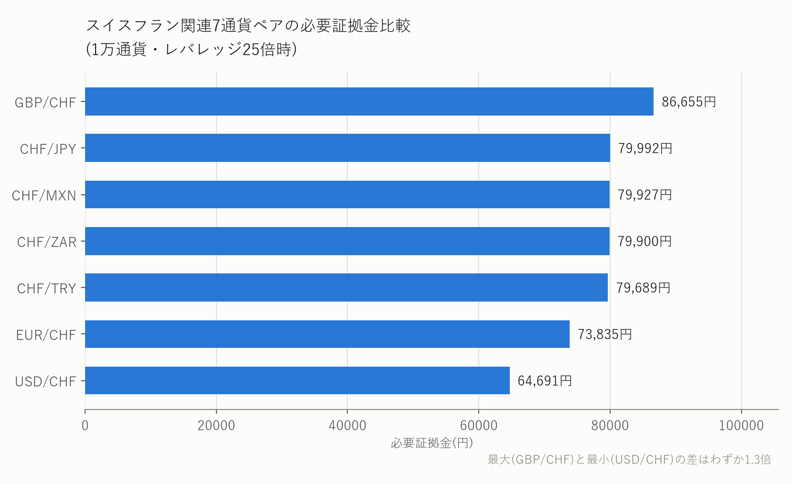
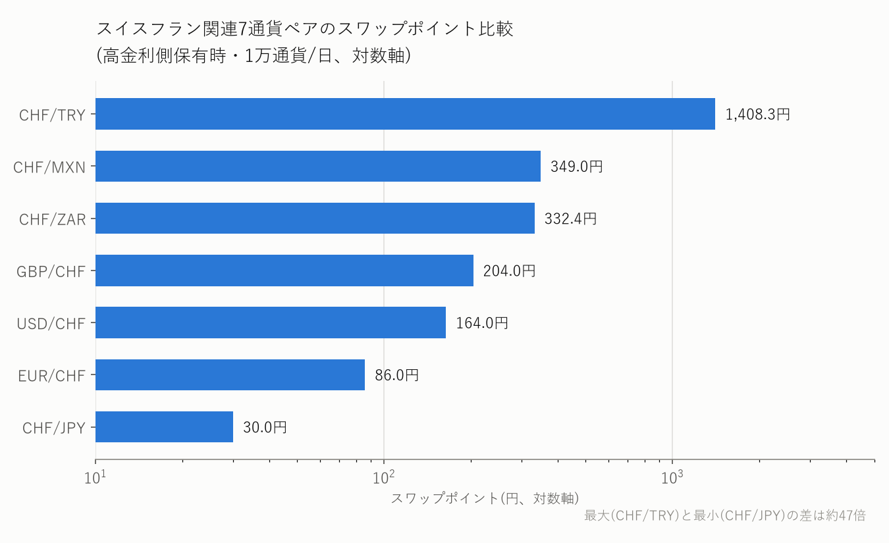
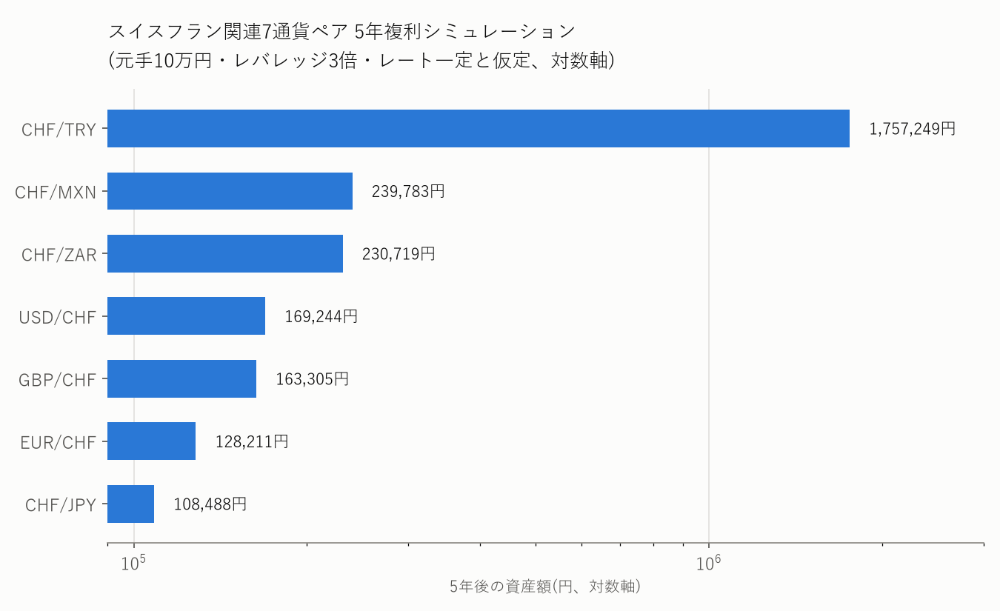
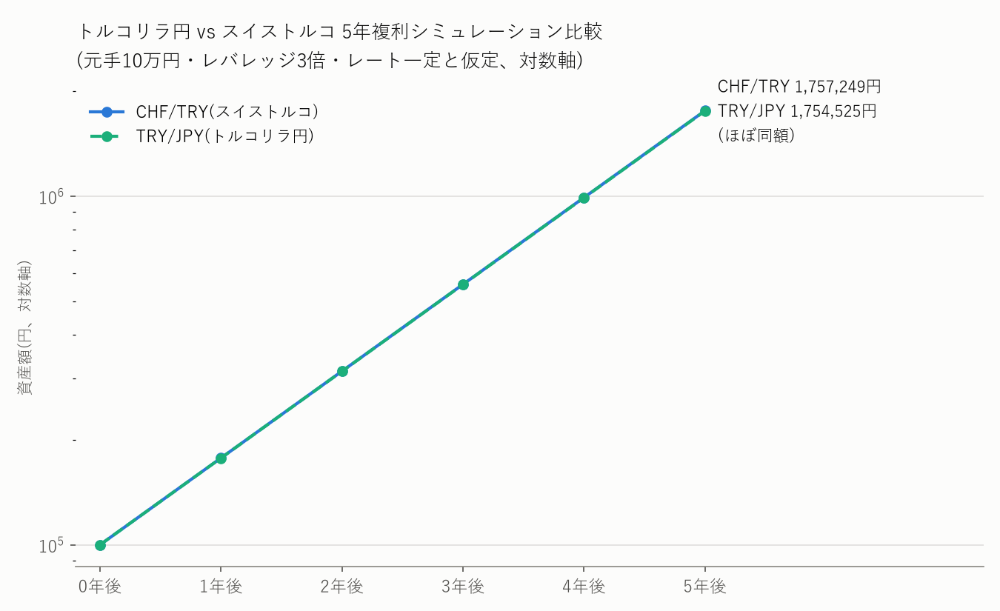

【2026年最新版】スイスフラン(CHF)関連7通貨ペア徹底比較——証拠金はほぼ横並びなのに、スワップだけ桁違いになる理由

こんにちわ！rational-labです！

## はじめに

トルコリラ・メキシコペソ・南アフリカランドと、これまで当ブログでは「高金利通貨を買ってスワップを稼ぐ」王道パターンを扱ってきました。今回はその裏側、**スイスフラン(CHF)を軸にした7つの通貨ペア**——GBP/CHF・USD/CHF・EUR/CHF・CHF/JPY・CHF/ZAR・CHF/MXN・CHF/TRY——を並べて比較します。

きっかけは、みんなのFXの必要証拠金一覧を眺めていて気づいたある違和感でした。この7ペアの必要証拠金（1万通貨・レバレッジ25倍時）は、安いUSD/CHFの64,691円から高いGBP/CHFの86,655円まで、最大でも1.3倍程度の差しかありません。ところがスワップポイントに目を移すと、最も小さいCHF/JPYの30円から最も大きいCHF/TRYの1,400円前後まで、実に**約47倍**もの開きがあります。

同じ「証拠金というモノサシ」で見ればほぼ横並びなのに、なぜスワップだけがここまで極端に分かれるのか。この記事では、

- スイスフランという通貨そのものの性格（低金利・安全資産・過去の急騰劇）
- 7通貨ペアの証拠金・スワップを一覧化した比較データ
- 証拠金とスワップの「差の正体」を政策金利差から読み解く
- 各通貨ペアごとの特徴と組み合わせ相手の政策金利
- 7通貨ペアそれぞれの5年複利シミュレーション
- 「トルコリラ円」と「スイストルコ」——同じ高スワップ通貨を、円で調達するかフランで調達するか
- スイスフランが「キャリートレードの調達通貨」として果たす役割
- 新興国クロス(CHF/ZAR・CHF/MXN・CHF/TRY)特有の注意事項
- 口座開設から実際の購入まで

の順に、データに基づいて解説します。投資判断は必ずご自身の責任で行ってください。

---

## 第1章：スイスフランとは何者か——政策金利0%と「安全資産」の顔

スイス国立銀行(SNB)の政策金利は、2026年6月18日の会合時点で**0%**です。SNBはこの会合で政策金利の据え置きを決定するとともに、物価安定を脅かすような急速かつ過度なフラン高が進んだ場合には為替介入も辞さない姿勢を改めて示しました。インフレ予測はエネルギー価格上昇の影響で足元やや上振れしているものの、SNB自身は「政策金利0%を維持する」という前提のもとで、2026年0.6%・2027年0.6%・2028年0.7%というインフレ見通しを示しており、当面この超低金利が続く可能性が高いとみられます。

スイスフランがなぜ「安全資産」と呼ばれるのかは、政策金利の低さとは別の理由に根ざしています。

- **政治的・財政的な安定性**：永世中立国としての政治的安定に加え、健全な財政と強固な対外収支、金融システムへの厚い信頼があります
- **購買力の維持**：スイスは構造的にユーロ圏などよりインフレ率が低く、購買力平価の観点から長期的にフランが増価しやすい構造にあります
- **危機時の資金逃避先**：地政学リスクの高まりや世界的な金融危機の局面で、投資家がリスク資産を売ってスイスフランへ資金を避難させる傾向があります

つまりスイスフランは「金利は低いが、有事には買われて急騰しうる」という、高金利通貨とはまったく逆の性格を持つ通貨です。この性格を頭に入れておくと、あとの章で見る「なぜCHFを売って新興国通貨を買うと高スワップになるのか」「なぜCHF自体が暴騰するリスクがあるのか」という2つの論点が、どちらも同じ一つの性質——CHFの低金利性と安全資産性——から説明できることが見えてきます。

---

## 第2章：2015年スイスフランショックの教訓

スイスフランの「急騰リスク」を語るうえで欠かせないのが、2015年1月に起きた「スイスフランショック」です。

欧州債務危機以降、ユーロ懸念からスイスフランへの逃避買いが急増し、フラン高がスイスの輸出産業を圧迫していました。これに対しSNBは2011年9月、**「1ユーロ＝1.20スイスフラン」を下限とする無制限介入**（ユーロ買い・フラン売り）に踏み切ります。しかしECBが量的緩和に踏み出すなど金融政策の乖離が進む中、この防衛ラインの維持は将来的な巨額損失リスクを高めると判断したSNBは、**2015年1月15日、事前予告なしに突然この下限を撤廃**しました。

結果は市場の大パニックでした。約1.20だったユーロ/フランは、わずか数分で**0.85〜0.86付近まで急落（フランは約30%急騰）**。流動性の急減とスプレッドの異常拡大でロスカット注文が想定価格で機能せず、多くの投資家・ヘッジファンドが致命的な損失を被り、一部の海外FXブローカーは破綻に追い込まれました。日本国内でも、証拠金以上の損失で口座残高がマイナスとなった件数は個人・法人合わせて1,229件、未収金の合計は約33億8,800万円に達したと報告されています。

この事例が教えてくれるのは、「スイスフランは金利が低いからといって、値動きまで穏やかとは限らない」という点です。低金利通貨としてCHFを売る(調達通貨にする)ポジションは、有事にフランが急騰した瞬間、真っ先に巻き戻しの標的になります。この点は第8章・第9章で改めて掘り下げます。

---

## 第3章：7通貨ペア徹底比較——証拠金とスワップの一覧データ

前置きが長くなりましたが、ここから本題です。みんなのFXの必要証拠金一覧・スワップカレンダーをもとに、GBP/CHF・USD/CHF・EUR/CHF・CHF/JPY・CHF/ZAR・CHF/MXN・CHF/TRYの7ペアを一覧にしました（数値は取得時点の目安、日々変動します）。

| 通貨ペア | 必要証拠金(1万通貨・レバレッジ25倍時) | 買いスワップ(1万通貨/日) | 売りスワップ(1万通貨/日) |
|---|---|---|---|
| GBP/CHF | 86,655円 | +203.9円 | -204.0円 |
| EUR/CHF | 73,835円 | +85.9円 | -86.0円 |
| USD/CHF | 64,691円 | +163.9円 | -164.0円 |
| CHF/JPY | 79,992円 | -30.0円 | +30.0円 |
| CHF/ZAR | 79,900円 | -332.4円 | +332.0円 |
| CHF/MXN | 79,927円 | -349.0円 | +348.8円 |
| CHF/TRY | 79,689円 | -1,424.4円 | +1,408.3円 |

証拠金は64,691円〜86,655円のレンジに収まり、最大と最小の差はわずか1.3倍。一方でスワップ（高金利側を保有した場合の絶対値）は、最小のCHF/JPY(30.0円)から最大のCHF/TRY(1,408.3円)まで**約47倍の開き**があります。これが「はじめに」で触れた違和感の正体です。

なお、CHF/TRYのスワップは他の6ペアと比べて日によるブレが大きく、直近1週間でも1,340円台〜1,600円台まで変動しています——この変動幅の大きさ自体も、CHF/TRYという通貨ペアの特徴の一つです。

なお、CHF/ZAR・CHF/MXN・CHF/TRYの3ペアについては、みんなのFXが特別な注意喚起を行っている通貨ペアでもあります。詳細は第9章で扱います。

---

## 第4章：なぜ証拠金は横並びなのに、スワップだけ桁違いなのか

必要証拠金は「取引金額（数量×レート）に対して、レバレッジ25倍を確保できる一定の証拠金率をかけて算出する」という、いわば共通のモノサシで決まります。7ペアともCHFを片脚に持つため、算出される証拠金の水準もおのずと近い範囲に収れんします。

一方でスワップポイントは、売買する2通貨の**政策金利差**でほぼ決まります。CHFの政策金利は0%なので、スワップの大きさは「相手通貨の政策金利がどれだけ高いか」でそのまま決まると言ってよく、これが7ペアの間でスワップだけが桁違いに分かれる直接の理由です。実際に主要な相手国・地域の政策金利を並べると、次のようになります。

| 相手通貨 | 政策金利(2026年7月時点の目安) | CHFとの金利差 |
|---|---|---|
| 日本(BOJ) | 1.00% | 1.00% |
| ユーロ圏(ECB・主要リファイナンス金利) | 2.40% | 2.40% |
| イギリス(BOE) | 3.75% | 3.75% |
| 米国(FRB・FFレート誘導目標) | 3.50〜3.75% | 3.50〜3.75% |
| メキシコ(Banco de México) | 6.50% | 6.50% |
| 南アフリカ(SARB) | 7.00% | 7.00% |
| トルコ(CBRT) | 37.00% | 37.00% |

この表とスワップ実績値を見比べると、傾向はおおむね一致します。金利差1.00%のCHF/JPYはスワップも30円程度と小さく、金利差3.75%前後のGBP/CHF・USD/CHFは160〜200円台、金利差6.5〜7%のCHF/MXN・CHF/ZARは330〜350円台、そして金利差37%のCHF/TRYだけが1,400円前後と突出しています。**「証拠金は取引金額の物差し、スワップは金利差の物差し」——2つのモノサシがまったく別の基準で動いている**、という点がこの記事の核心です。

---

## 第5章：通貨ペアごとの特徴——組み合わせ相手はどんな通貨か

### GBP/CHF・EUR/CHF・USD/CHF——先進国通貨同士の組み合わせ

いずれも先進国通貨とCHFの組み合わせで、新興国クロスのような極端な値動きはしにくい一方、スワップも中程度(86〜204円)にとどまります。GBP/CHFはイギリスの政策金利3.75%を反映してこの3ペアの中では最もスワップが大きく、EUR/CHFはECBの利上げ局面が続けば今後さらにスワップが拡大する可能性があります。

### CHF/JPY——スワップは小さいが値動きの参考指標として有用

日本の政策金利は2026年6月にBOJが1.0%まで引き上げたばかりで、CHFとの金利差はこの7ペアの中で最小です。スワップ狙いの投資対象としての魅力は薄いですが、「有事の資金逃避先」であるCHFと円が組み合わさるペアとして、リスクオフ局面での値動きの参考にする使い方もあります。

### CHF/ZAR・CHF/MXN——新興国クロスの中では比較的中規模

南アフリカランド(政策金利7.00%)・メキシコペソ(同6.50%)は、当ブログでも単体（ZAR/JPY・MXN/JPY）で取り上げてきた高金利通貨です。CHFを売ってこれらを買う形になるため、スワップは330〜350円台とCHF/JPYの10倍以上になります。

### CHF/TRY——桁違いのスワップと桁違いのリスク

トルコの政策金利37.00%という突出した高さがそのままスワップに直結し、7ペアの中で唯一1,400円前後という別次元の水準になっています。ただし当ブログで繰り返し触れてきた通り、トルコリラは過去10年以上にわたり価値の下落が続く「慢性的な通貨安」を抱えた通貨でもあります。スワップの大きさだけを見て安易に飛びつくべきではなく、第7章で見るトルコリラ円との比較や、第9章で触れる特別ルールも含めて理解した上で検討してください。

---

## 第6章：5年複利シミュレーション——複利で見る7ペアの差

第4章で見た証拠金とスワップの差が、実際に長期運用した場合の資産推移にどう跳ね返るかを試算しました。前提は「元手10万円・レバレッジ3倍（当ブログで繰り返し推奨してきた保守的な水準）・各ペアの高金利側を保有・受け取ったスワップをそのまま再投資・為替レートは5年間一定」という単純化したモデルです（南アフリカランド円の過去記事で使ったシミュレーションと同じ手法です）。

| 通貨ペア | 想定年利換算 | 1年後 | 3年後 | 5年後 |
|---|---|---|---|---|
| CHF/JPY | 1.64% | 101,643円 | 105,009円 | 108,488円 |
| EUR/CHF | 5.10% | 105,096円 | 116,079円 | 128,211円 |
| GBP/CHF | 10.31% | 110,306円 | 134,215円 | 163,305円 |
| USD/CHF | 11.10% | 111,097円 | 137,122円 | 169,244円 |
| CHF/ZAR | 18.20% | 118,200円 | 165,139円 | 230,719円 |
| CHF/MXN | 19.11% | 119,114円 | 169,002円 | 239,783円 |
| CHF/TRY | 77.41% | 177,405円 | 558,342円 | **1,757,249円** |

CHF/TRYが他の6ペアを大きく引き離す伸びを見せ、5年後には元手10万円が約176万円になる計算です。ただし、これはあくまで「5年間レートが一切動かなかった場合」の機械的な試算です。第2章で見た通り、CHFは有事に数分で30%動くことさえある通貨であり、現実にはこの表のようにはまず増えません。複利の伸びと同時に、為替差損リスクも決して小さくならないことを示す反面教師として見てください。

---

## 第7章：トルコリラ円 vs スイストルコ——同じ高スワップ通貨を、円で調達するかフランで調達するか

CHF/TRYの突出したスワップを見て、「結局トルコリラ円(TRY/JPY)と何が違うのか」と思われた方も多いはずです。どちらも「低金利通貨を売ってトルコリラを買う」というキャリートレードである点は共通していますが、**調達通貨が円かスイスフランかという違い**があります。同じ条件（元手10万円・レバレッジ3倍・5年間・レート一定）で比較してみます。

| | トルコリラ円(TRY/JPY) | スイストルコ(CHF/TRY) |
|---|---|---|
| 調達通貨の政策金利 | 日本(BOJ) 1.00% | スイス(SNB) 0% |
| 必要証拠金(1万通貨・25倍時) | 約1,376円 | 79,689円 |
| スワップ目安(1万通貨/日) | 約24.3円(変動あり) | 約1,408.3円(変動あり) |
| 想定年利換算(レバレッジ3倍) | 77.35% | 77.41% |
| 5年後の資産額(元手10万円) | 1,754,525円 | **1,757,249円** |

理論上は、調達通貨の政策金利がJPY(1.00%)よりCHF(0%)の方が低い分、トルコとの金利差はCHF/TRY(37%)の方がTRY/JPY(36%)よりわずかに大きく、スワップ効率もCHF/TRYの方が有利になりそうです。実際の想定年利換算を計算してみると77.35%対77.41%と、その差はわずか0.06ポイント、5年後の資産額でも1,754,525円対1,757,249円とほぼ同額という結果になりました。

この僅差は、理論の正しさというより「ほぼ誤差の範囲」と捉えるべきです。第3章・本章で見た通り、CHF/TRYのスワップは直近1週間で1,340円台〜1,600円台、トルコリラ円のスワップも22.3円〜25.3円の範囲で日々変動しており、この変動幅は両者の年利換算の差(0.06ポイント)よりもずっと大きいためです。つまり「調達通貨を円からスイスフランに変えれば理論上わずかに有利」というのは机上の計算上は成り立つものの、実際のスワップ相場の変動幅の中に埋もれてしまう程度の差でしかない、というのがより正確な結論です。

なお必要証拠金の違いが意味するリスクの違いも見落とせません。トルコリラ円は必要証拠金が極めて小さいため、同じ10万円の予算でもスイストルコよりずっと大きな数量のポジションを持つことになり、トルコリラ自体の為替変動の影響を強く受けます。一方スイストルコは、持てる数量こそ小さいものの、**CHF自体が有事に急騰するというトルコリラ円にはないリスク**（第2章・第8章で見た2015年ショックのような急変動）を別途抱えます。

**「5年後の資産額がほぼ同じなら、必要証拠金が桁違いに小さく、CHF特有の急騰リスクを負わずに済むトルコリラ円の方が、同じ結果をより少ないリスクで得られる」**——これがトルコリラ円とスイストルコを比べて見えてくる、最も重要な教訓です。理論上の金利差だけで「調達通貨をCHFにすれば有利」と判断せず、必要証拠金・実際のスワップ相場・調達通貨ごとのリスクをセットで比較する必要があります。

---

## 第8章：スイスフランは「調達通貨」——キャリートレードと巻き戻しリスク

キャリートレードとは、金利の低い通貨を売って資金を調達し、金利の高い通貨を買って運用し、その金利差（スワップ）を稼ぐ手法です。CHF/ZAR・CHF/MXN・CHF/TRYのように「CHFを売って高金利通貨を買う」ポジションは、まさにこのキャリートレードの一種であり、CHFはその調達通貨（売り建て通貨）として使われています。

これは長らく日本円が担ってきた役割と同じ構図です。実際、日銀が2024年にマイナス金利を解除して以降、緩やかながら利上げを続ける一方、SNBはインフレ鈍化に伴って利下げを重ねてきたため、短期金利で日本がスイスを上回る局面も生まれ、市場ではキャリートレードの調達通貨が「円からスイスフランへ」シフトする動きも指摘されています。

円キャリーとCHFキャリーには共通の弱点があります。市場が平穏なときは活発に積み上がりますが、**地政学リスクの高まりや株式市場の急落などで市場心理が悪化すると、一斉に買い戻される**という点です。CHFの場合、この巻き戻しはただの利益確定売りでは終わりません。前述の通りCHF自体が「安全資産」として買われる性質を持つため、キャリートレードの巻き戻し（CHF買い戻し）と、リスクオフによる逃避買い（CHF買い）が同じ方向に重なり、短期間で急激なフラン高を引き起こしやすくなります。2015年のスイスフランショックや、2024年8月の市場混乱時の円キャリー巻き戻しは、その典型例として挙げられます。

つまりCHFを売るポジション（CHF/ZAR・CHF/MXN・CHF/TRYの買い、あるいはGBP/CHF・EUR/CHF・USD/CHFの売り）を長期間持つということは、「相手通貨の金利差というプラス材料」と「CHF自体の急騰という巻き戻しリスク」を、常に両方抱えているということを意味します。

---

## 第9章：見落としてはいけないリスクと注意点

### ①CHF自体の急騰リスク（2015年ショックの再来リスク）

第2章・第8章で見た通り、CHFは「有事に急騰する」という、高金利通貨とは正反対の値動きをする場面があります。スワップ益を長期間積み上げても、CHFの急騰局面で為替差損が一気に膨らみ、それまでの利益を吹き飛ばすリスクは常に存在します。

### ②CHF/ZAR・CHF/MXN・CHF/TRYの特別ルール

みんなのFXでは、この3ペアについて以下のような特別な取引ルールが設けられています。

- **新興国通貨側の変動リスク**：ZAR・MXN・TRYはいずれも主要通貨より市場流動性が低く、スプレッド拡大や急変動が起きやすい通貨です
- **スワップの円換算タイミング差**：円を含まない「外貨通貨ペア」に該当するため、スワップは営業日クローズ時点の仲値レートで円換算されます。為替が大きく動くと、スワップカレンダーの概算値と実際の付与額に差が出ることがあります
- **Pip単位の違い**：一般的な通貨ペアが小数点第4位を基準とするのに対し、この3ペアは小数点第2位（0.01）が基準です
- **建玉・発注の上限**：CHF/TRYは建玉上限10Lot・発注上限10Lot、CHF/ZAR・CHF/MXNは建玉上限100Lotと、他の主要ペアより厳しく制限されています
- **1Lotあたりの取引金額が大きい**：想定元本が大きいため、少ないLot数でもスプレッド換算額やスワップポイントが大きくなりやすく、実効レバレッジの管理が重要になります

### ③スワップは政策金利差で変動する

第4章で見た通り、スワップの大きさは各国・地域の政策金利差にほぼ連動します。トルコが利下げに転じたり、SNBがマイナス金利に踏み込んだりすれば、スワップの水準そのものが変わる可能性があります。

### リスクを抑えるための実践的なポイント

- レバレッジを低めに抑え、証拠金維持率に常に余裕を持たせる
- CHF/TRYなど新興国クロスは特別ルール（Pip単位・建玉上限）を事前に確認する
- CHFの急騰リスクに備え、逆指値（損切りライン）を必ず設定する
- 一つの通貨ペアに集中せず、当ブログで扱ってきたトルコリラ円・メキシコペソ円・南アフリカランド円などとも分散する

---

## 第10章：口座開設から実際の購入まで

### ステップ1：FX会社を選ぶ

みんなのFXはCHF関連7ペアすべてを取り扱っており、今回のデータもみんなのFXを基準にしています。他社比較をしたい場合も、まずは業界大手のみんなのFXで値動きやスワップの感覚をつかむのがおすすめです。

### ステップ2：口座を開設する

公式サイトの申込フォームでメールアドレスを登録し、氏名・住所・投資目的などを入力します。本人確認書類（運転免許証・パスポートなど）とマイナンバー確認書類をオンラインでアップロードして審査を受けます。

### ステップ3：資金を入金する

提携銀行のネットバンキングを使った「クイック入金」なら、手数料無料・即時反映が一般的です。

### ステップ4：注文方法を選んで購入する

取引したい通貨ペア（例：CHF/TRY）を選び、「買い」または「売り」注文を出します。

- **成行注文**：今の価格ですぐ売買する
- **指値注文**：「今より有利な価格になったら」の予約注文
- **逆指値注文**：損切り用。「一定水準まで逆行したら自動決済」

### ステップ5：スワップの受け取り方を確認する

みんなのFXでは、ポジションを決済せずにスワップポイントだけを受け取ることが可能です。「ポジション照会」画面から個別に、またはアプリの「スワップ一括受取」機能でまとめて受け取れます。受け取ったスワップは口座の純資産に含まれるため、受取操作の前後で証拠金維持率が変動することはありません。

なお、FXの利益（為替差益＋スワップポイント）は「先物取引に係る雑所得等」として一律20.315%の申告分離課税の対象です。ポジションを決済せず保有し続ける限り課税されず、決済時または「スワップ受取」操作を行った時点で課税対象になります。他の先物取引（くりっく365・CFD等）との損益通算や、損失が出た場合の3年間の繰越控除も可能です（給与所得者は年間20万円超の利益で確定申告が必要）。

---

## まとめ

スイスフラン関連7通貨ペアを並べてみると、証拠金という「取引金額の物差し」ではほぼ横並びなのに、スワップという「政策金利差の物差し」では最大約47倍もの差が生まれることがわかりました。この差の大枠は、CHFの政策金利0%と、相手通貨の政策金利がどれだけ高いかで説明できます。

同時に、CHFは「低金利で調達しやすい通貨」であると同時に「有事に急騰する安全資産」という、相反する2つの顔を持つ通貨でもあります。2015年のスイスフランショックが示した通り、この急騰リスクはスワップ益をまとめて吹き飛ばしかねない破壊力を持っています。

CHF/TRYとトルコリラ円(TRY/JPY)の5年複利シミュレーションを比べると、元手10万円がそれぞれ約176万円・約175万円とほぼ同額になりました。理論上はCHFで調達した方が金利差の分だけ有利なはずですが、実際のスワップ相場の日々の変動幅の方がその理論上の差より大きく、結果的にほぼ差が消えてしまう格好です。「金利差が大きい＝スワップ効率が高い」と単純に考えず、実際のスワップ相場を必ず確認する必要があることを示す好例です。

**「スワップの大きさだけでなく、その裏にある政策金利差の構造と、CHF自体の急騰リスクをセットで理解する」**——これがスイスフラン関連通貨ペアと付き合う上での、最も現実的なスタンスだと言えるでしょう。

※本記事は情報提供を目的としたものであり、特定の投資商品の売買を推奨するものではありません。本記事で扱う金融商品には価格変動によって元本を上回る損失が生じるリスクがあります。投資判断は、必ずご自身の責任において行ってください。
